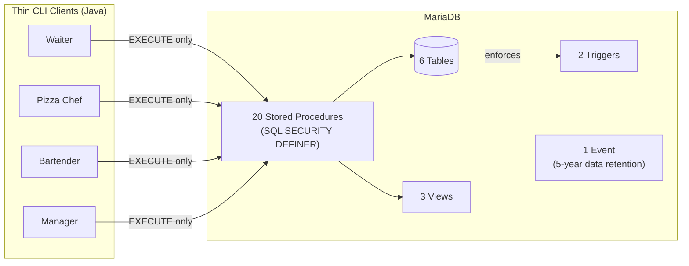
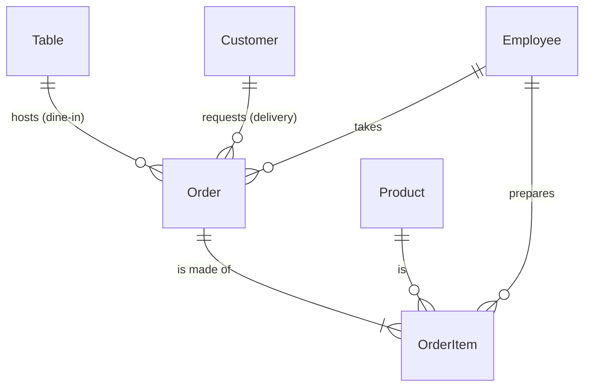

# 🍕 Pizzeria Management System

A full-stack database project for a multi-channel pizzeria (dine-in, takeaway,
delivery), built around a **security-first architecture** where every business
rule lives inside the database, not the client.

> University project for the Databases course, University of Rome Tor Vergata
> — A.Y. 2025/2026.

---

## Overview

The system supports the full order lifecycle for a pizzeria operating on three
channels — dine-in, takeaway, and phone-in delivery — with four distinct
staff roles: **waiter**, **pizza chef**, **bartender**, and **manager**. Each
role gets its own CLI client view, backed by its own database user with the
minimum privileges it needs.

The core design principle: **the client never talks to a table directly**. No
application user has `SELECT`, `INSERT`, `UPDATE`, or `DELETE` grants on any
table — only `EXECUTE` on the stored procedures relevant to their role. Every
business rule (a table can't be double-booked, only a pizza chef can mark a
pizza ready, an order can't close with undelivered items) is enforced inside
the procedure layer, where it can't be bypassed by rewriting the client.

## Highlights

- **Entity-relationship design** built with a documented inside-out strategy,
  reasoning explicitly about the difference between a *menu item* and an
  *ordered unit* — the distinction that drives most of the schema.
- **Normalized to BCNF**, with two deliberate, cost-justified redundancies
  (a stored order total, a cached table status) and one redundancy explicitly
  rejected because it would have broken 3NF.
- **Concurrency control done right**: row-level locking (`SELECT ... FOR
  UPDATE`) prevents two waiters from double-booking the same table or two
  concurrent inserts from colliding on the same progressive item number —
  without resorting to `SERIALIZABLE` and its throughput cost.
- **Isolation levels chosen per procedure**, not left to the default:
  `REPEATABLE READ` for write transactions protected by explicit row locks,
  `READ COMMITTED` + `READ ONLY` for read-only ones.
- **Zero direct table access** for any application role — 20 stored
  procedures, `SQL SECURITY DEFINER`, and per-role MariaDB users are the only
  way in.
- **Per-item preparation tracking**: an order's state isn't a single flag —
  each item (a pizza, a drink) has its own lifecycle from *pending* to
  *ready* to *served*, which is what the real-world spec actually asks for.

## Architecture



No arrow skips the procedure layer — that's the point.

### Why procedures over triggers

Business logic sits in stored procedures rather than triggers wherever a
decision depends on a prior read: a procedure can acquire a row lock and
*then* decide whether to write, while a trigger fires only after the write has
already happened and can't prevent a race condition. Triggers are reserved for
the two cross-table assertions that must hold no matter which procedure wrote
the data (an order can't be modified once completed).

## Database design

| Object | Count |
|---|---|
| Tables | 6 |
| Views | 3 |
| Stored procedures | 20 |
| Triggers | 2 |
| Scheduled events | 1 |
| Performance indexes | 2 |
| Database users (role-based) | 5 |



*(Simplified — the actual schema collapses three E-R generalizations
(product type, order channel, staff role) into single tables with a
discriminator column, a deliberate trade-off documented and justified in the
project report based on operation cost analysis.)*

## Tech stack

- **Database**: MariaDB 10.11, InnoDB
- **Client**: Java 17, plain JDBC (`mariadb-java-client`)
- **Architecture**: MVC + DAO, one stored procedure per business operation
- **No ORM, no framework** — deliberately: the point of the project is the
  database design and the SQL, not abstracting it away

## Project structure

```
src/it/uniroma2/dicii/bd/
├── Main.java
├── controller/        # orchestrates DAO calls, drives each role's menu loop
├── view/               # console I/O only — no business logic
├── model/
│   ├── dao/            # one class per stored procedure (CallableStatement)
│   ├── domain/          # POJOs mapping procedure outputs
│   └── dto/             # records for procedure inputs
└── exception/          # DAOException -> ControllerException -> ApplicationException
```

## Getting started

**1. Set up the database**

```bash
mariadb -u root < pizzeria.sql
```

This creates the schema, all database objects, five role-based users, and a
small seed dataset (20 tables, 7 staff members, 25 menu items).

**2. Configure the client**

Point `resources/db.properties` at your MariaDB instance — the seed script
already creates matching users (`app_login`, `app_cameriere`,
`app_pizzaiolo`, `app_barman`, `app_gestore`).

**3. Run**

```bash
javac -d build -cp libs/mariadb-java-client-3.0.8.jar $(find src -name "*.java")
java -cp build:libs/mariadb-java-client-3.0.8.jar it.uniroma2.dicii.bd.Main
```

Try `pesposito` / `pesposito` for the pizza chef view, or `mrossi` / `mrossi`
for the manager.

## Testing

The system was validated with a manual test battery covering the full order
lifecycle across all four roles (table assignment race conditions, role
mismatches, incomplete orders, price freezing on menu changes), plus direct
SQL tests to verify triggers, `CHECK` constraints, and privilege boundaries
that the client itself can't exercise — including confirming that a
role-scoped database user genuinely cannot read a table it wasn't granted.

## Possible extensions

- Table reservations with time-slot conflict checking
- Multi-location support
- A connection pool, if the client needed to scale beyond single-user CLI use

---

*Built as a coursework project — happy to walk through any design decision in
more depth.*
